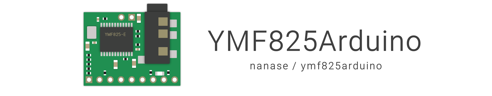

## Features

- Supports two [YMF825Board](https://yamaha-webmusic.github.io/ymf825board/intro/) for stereo
- Supports manipulation of any operator
- Supports manipulation of any 3-band equalizer

## How to use

After installing the library, include `ymf825.h`.

`ymf825.h` supports low-level functions and allows direct manipulation of YMF825 registers.
`ymf825/driver.h` supports high-level functions and wraps register operations. In addition, `ymf825/tonePresets.h` includes presets for tone parameters.

```cpp
#include "ymf825.h"
#include "ymf825/driver.h"
#include "ymf825/tonePresets.h"
```

Specify reset (/RESET) and slave select (/SS) pins of the YMF825 and declare the device and driver variables.

```cpp
#define PIN_RESET PIN_A6
#define PIN_SS PIN_A7

YMF825 ymf825(PIN_RESET, PIN_SS);
YMF825Driver driver(&ymf825);
```

Initialize the YMF825 before you begin operating the device. `initialize(voltage)` function resets the device with hardware reset. The parameter must be set to correct voltage as a constant.
The YMF825 does not set any tone parameters to sound immediately after initialization. You can set any tone parameters with `setTone(tone)` function.

```cpp
void setup() {
  driver.initialize(YMF825_VOLTAGE_3V3);
  driver.setTone(YMF825TonePresets::Default);
}
```

To start the sound, call `noteOn(voice, octave, tone)` function. To stop the sound, call `noteOff(voice) ` function. As with MIDI, nothing happens when you call `noteOff` when there is no sound.

```cpp
void loop() {
  const uint8_t NOTES[] = {
    YMF825_NOTE_C, YMF825_NOTE_D, YMF825_NOTE_E, YMF825_NOTE_F,
    YMF825_NOTE_G, YMF825_NOTE_F, YMF825_NOTE_E, YMF825_NOTE_D,
  };

  for (uint8_t i = 0; i < sizeof(NOTES); i++) {
    driver.noteOff(0);  // for voice #0
    delay(25);
    driver.noteOn(0, 4, NOTES[i]);  // for voice #0, octave 4
    delay(475);
  }
}
```

See [here](./examples/simple_tone/simple_tone.ino) for a compilable sketch.

## License

[__MIT License__](./LICENSE)
